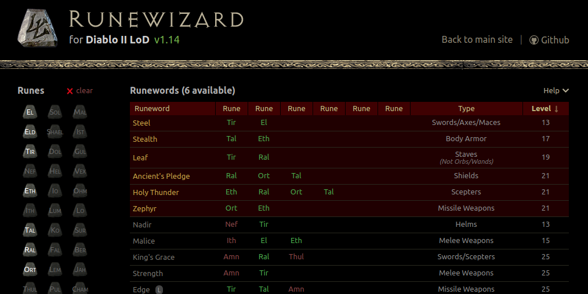

## New repository, new home!

Runewizard has been rewritten from scratch with modern Javascript, source code available at: **[github.com/fabd/diablo2-runewizard](https://github.com/fabd/diablo2-runewizard)**.

For the live version [follow this link](https://fabd.github.io/diablo2-runewizard) or click the screenshot below!

_PS: please note the new version saves state in the browser's "localStorage" instead of a cookie. If you manually clear "Cookies and other site data" in your browser, the selected runes will be reset._

  

